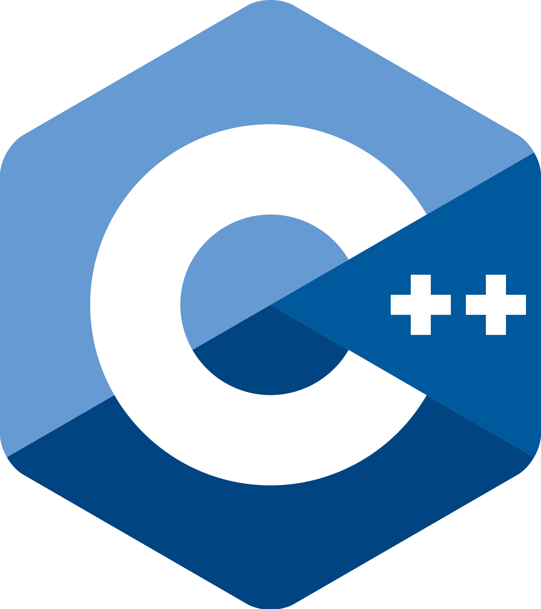
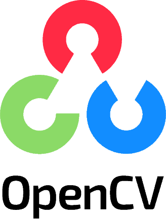

<!DOCTYPE html>
<html lang="pt-br">
<head>
    <meta charset="UTF-8">
    <meta name="viewport" content="width=device-width, initial-scale=1.0">
    <title>Jump King Jumping in Real Life</title>
    
</head>
<body>

<h1>Jump King Jumping in Real Life!</h1>

    

    
<strong>(pt-br)</strong> Este projeto é totalmente desenvolvido em C++ e oferece uma aplicação que permite aos usuários usar seus movimentos capturados pela webcam para jogar jogos. Especificamente adaptado para o jogo JumpKing, o programa utiliza o OpenCV para processar as imagens.

    

        
        
    

    
<strong>(en-us)</strong> This project is entirely developed in C++ and provides an application that allows users to use their movements captured by the webcam to play games. Specifically tailored for the game JumpKing, the program utilizes OpenCV to process images.

    
<strong>(pt-br)</strong> Qualquer valor doado será imensamente bem-vindo! Para doações enviadas no PIX (QR code acima) com o valor igual ou superior a 10 reais, o doador irá receber o executável (.exe) mais atualizado do programa via Email (envie o email onde o programa deve ser enviado na mensagem do PIX, ou faça a requisição pelo <a href="https://forms.gle/L3V9vTZEpExnqrKb6" target="_blank">Google Forms</a>).

    
<strong>(en-us)</strong> Any donated amount will be greatly appreciated! For donations sent via PIX (QR code above) with a value equal to or greater than 10 Reais, the donor will receive the most up-to-date executable (.exe) of the program via email. (Send the email address where the program should be sent in the PIX message, or request it through the <a href="https://forms.gle/L3V9vTZEpExnqrKb6" target="_blank">Google Forms</a>).

    

</body>
</html>
