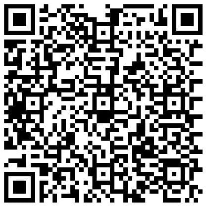

# Jump King Jumping in Real Life
{width=50px height=50px}

## Description 

*(pt-br)*
Este projeto é totalmente desenvolvido em C++ e oferece uma aplicação que permite aos usuários usar seus movimentos capturados pela webcam para jogar jogos. Especificamente adaptado para o jogo JumpKing, o programa utiliza o OpenCV para processar as imagens.

.png){: width="200px" height="150px"} .png){: width="200px" height="150px"}

Com essa aplicação, os usuários podem criar quadrados na tela e associar teclas a eles. Sempre que um movimento for detectado dentro do quadrado, a tecla correspondente será pressionada. O programa também inclui uma funcionalidade adaptada para jogar JumpKing, onde é possível detectar os pulos. Uma linha será exibida na tela, e quanto mais alto o usuário pular acima dessa linha, mais alto o personagem do JumpKing irá pular.

*(en-us)*
This project is entirely developed in C++ and provides an application that allows users to use their movements captured by the webcam to play games. Specifically tailored for the game JumpKing, the program utilizes OpenCV to process images.

With this application, users can create squares on the screen and associate keys with them. Whenever a movement is detected within the square, the corresponding key will be pressed. The program also includes a feature adapted for playing JumpKing, where it can detect jumps. A line will be displayed on the screen, and the higher the user jumps above this line, the higher the JumpKing character will jump.

## Support! :) 
{: width="200px" height="150px"}

*(pt-br)*
Qualquer valor doado será imensamente bem-vindo! Para doaçoes enviadas no PIX (QR code acima) com o valor igual ou superior a 10 reais, o doador irá receber o executável (.exe) mais atualizado o programa via Email (envie o email onde o programa deve ser enviado na mensagem do PIX, ou faça a requisição pelo [Google Forms](https://forms.gle/L3V9vTZEpExnqrKb6)).

*(en-us)*
Any donated amount will be greatly appreciated! For donations sent via PIX (QR code above) with a value equal to or greater than 10 Reais, the donor will receive the most up-to-date executable (.exe) of the program via email. (Send the email address where the program should be sent in the PIX message, or request it through the [Google Forms](https://forms.gle/L3V9vTZEpExnqrKb6)).
